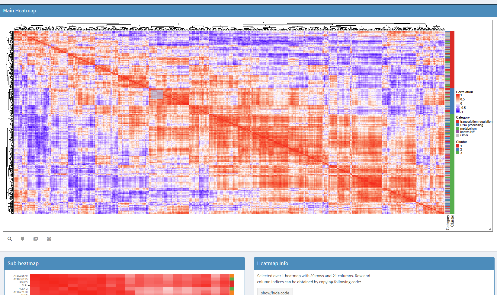

# Gene Co-Expression Heatmap Explorer

Interactive Shiny web application for exploring gene co-expression networks through clustered correlation matrices. Leverages hierarchical clustering and `InteractiveComplexHeatmap` for responsive visualization of large-scale biological data.



---

## ✨ Features

- 📈 **Interactive heatmap** of gene correlation matrix (via ComplexHeatmap)
- 🔍 **Dynamic sub-heatmap** display via:
  - **Zoom Mode** – user-defined region selection
  - **Cluster Mode** – view entire cluster based on cut-tree
- 🧬 **Multi-gene search** with autocomplete
- 🎯 **Highlight categories** in side annotation bar (supports “Top 5”, “NPC”, custom tags)
- 📤 **Export table** of selected genes
- 🎨 **DotPlot overlay** using Seurat metadata (when available)
- 📊 **Matrix size control** and **filtering sliders** for inside/outside correlation thresholds

---

## 🧰 Requirements

- **R version**: ≥ 4.3.2
- **Package management**: `renv` supported (see `renv.lock` in repo)

### 📦 Main R packages

| Package                   | Version |
| ------------------------- | ------- |
| shiny                     | 1.10.0  |
| shinydashboard            | 0.7.3   |
| data.table                | 1.17.0  |
| ComplexHeatmap            | 2.18.0  |
| InteractiveComplexHeatmap | 1.10.0  |
| circlize                  | 0.4.16  |
| shinycssloaders           | 1.1.0   |
| Cairo                     | 1.6.2   |
| DT                        | 0.33    |
| ggplot2                   | 3.5.2   |
| shinyjs                   | 2.1.0   |
| heatmaply                 | 1.5.0   |
| plotly                    | 4.10.4  |
| ggnewscale                | 0.5.1   |
| Seurat                    | 5.2.1   |

---

## 🚀 Installation

```bash
git clone https://github.com/krishna-creator/gene_co-expression_tool.git
cd gene_co-expression_tool
```

Use renv to restore package versions:

```r
renv::restore()
```

Or manually install key packages:

```r
install.packages(c("shiny", "shinydashboard", "data.table", "ComplexHeatmap",
                   "InteractiveComplexHeatmap", "circlize", "shinycssloaders",
                   "Cairo", "DT", "ggplot2", "shinyjs", "heatmaply", "plotly",
                   "ggnewscale"))
```

---

## ▶️ Usage

```r
shiny::runApp("app.R")
```

---

## 🧭 Interface Overview

1. Select dataset from dropdown
2. Choose matrix type:
   - **Full Matrix** – complete co-expression matrix
   - **Reduced Matrix** – downsampled view
   - **Top N Genes** – ranked by correlation magnitude
3. Choose filtering mode:

   - **None** – show all
   - **Inside Range** – keep correlations within a band
   - **Outside Range** – mask values within a range

4. Heatmap Interactions:

   - Hover to inspect values
   - **Zoom Mode**: select region → sub-heatmap, dot plot, gene table
   - **Cluster Mode**: select cluster from dropdown

5. Highlight any category (e.g., `"NPC"`, `"Abiotic"`) in side bar

6. Use sub-heatmap, dot plot (if Seurat data exists), and download/export buttons

---

## 📁 Adding Your Own Datasets

### 🧪 Matrix Format (Required)

- `.rds` file of a square correlation matrix
- **Optionally** include:
  - `GeneID` column (row key)
  - `GeneName` column (alternative display)
  - `category` column (e.g., "Abiotic", "NPC")

### 🛠️ Preprocessing Instructions

```r
# Step 1: Cluster and reorder the matrix
source("matrix_clustering.R")
reorder_correlation_matrix("input.csv", "clustered_output.csv")

# Step 2: Convert to .rds format
source("csv_to_rds_rounded_3.R")
convert_csv_to_rds("clustered_output.csv")
```

### 🗂️ Add to App

1. Move `.rds` file to `data/`
2. Register in `global.R`:

```r
file_paths <- list(
  ...
  "My Matrix" = "data/my_matrix.rds"
)
```

---

## ⚠️ Data Requirements Summary

| Column       | Required              | Description                          |
| ------------ | --------------------- | ------------------------------------ |
| GeneID       | ✅ if metadata exists | Identifier for each gene             |
| GeneName     | optional              | For display only                     |
| category     | optional              | Used in highlight mode               |
| matrix cells | ✅                    | Numeric correlation matrix (−1 to 1) |

---

## ⚡ Performance Notes

- Recommended max:
  - Full Matrix: ≤ 2000×2000
  - Reduced Matrix: ≤ 500×500
- Sub-heatmap cutoff: max 350 genes selected
- Processing time: 2k×2k matrix < 60 seconds with clustering

---

## 🛟 Support

For feature requests or issues, [open a GitHub issue](https://github.com/krishna-creator/gene_co-expression_tool/issues)

---

## 📄 License

MIT License © 2024  
Project maintained by Li Lab
